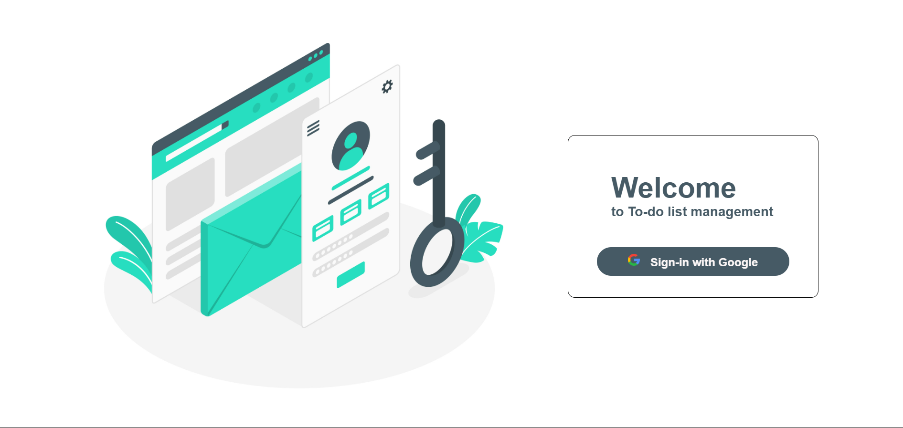

# To-do List Web App with Google Sign-In

This is a simple and secure To-do List web application that allows users to sign in using their Google account and manage their daily tasks efficiently.

## ✨ Features

- 🔐 Google Sign-In authentication (via Firebase)
- 📋 Add and manage to-do tasks
- 🧹 Clear UI and responsive design
- ✅ Session handling with logout support
- 🔄 Auth state persistence

## 🔧 Tech Stack

- HTML, CSS, JavaScript
- Firebase Authentication

## 📐 Architecture Diagram

## 🎥 Demo Video

📹 [Watch the demo video](https://www.loom.com/share/your-loom-video-link)

> In the video, I explain the structure, features, and working of the app.

---
